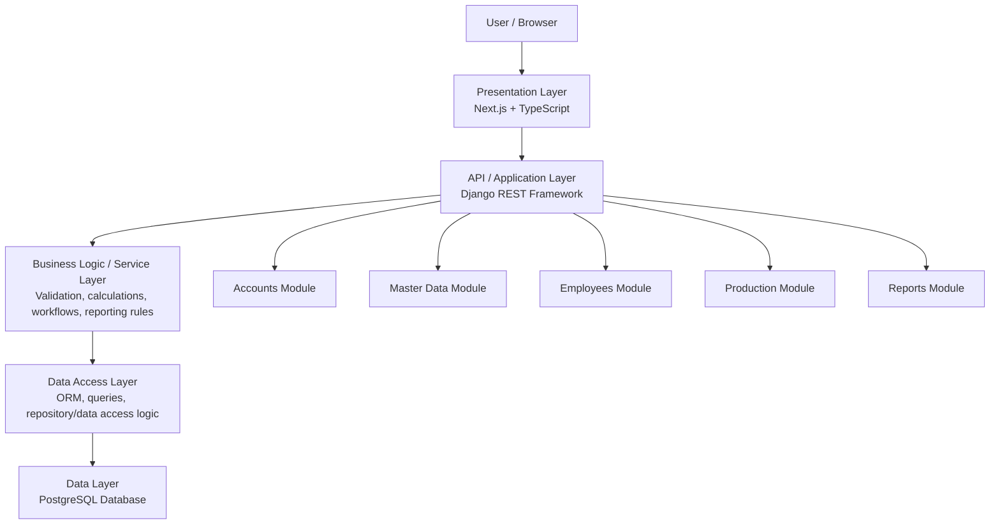

# AR Metals Production - Proposed Architecture

## 1. Architecture Style

The proposed system follows an API-based layered modular monolith architecture.

This means:
- the application will be built as one main system
- the system will be divided into functional modules
- the frontend, backend logic, and database will be separated into layers
- new modules can be added later without rebuilding the whole application

## 2. Technology Stack

- Frontend: Next.js with TypeScript
- Backend API: Django with Django REST Framework
- Business Logic Layer: Django service layer
- Data Access Layer: ORM and query/repository logic
- Database: PostgreSQL

## 3. Layered Structure

- Presentation Layer
  Handles the user interface, navigation, pages, forms, tables, and reports.

- API / Application Layer
  Receives requests from the frontend and sends responses.

- Business Logic / Service Layer
  Contains application rules such as validation, calculations, workflows, and report logic.

- Data Access Layer
  Handles ORM operations and database query logic.

- Data Layer
  Stores all system data in PostgreSQL.

## 4. High-Level Request Flow

User Browser
-> Frontend Layer
-> API / Application Layer
-> Business Logic / Service Layer
-> Data Access Layer
-> PostgreSQL Database

## 5. Initial Modules

- Accounts
- Master Data
- Employees
- Production
- Reports

## 6. Current Scope of Modules

### Accounts
- Login
- Logout
- User roles
- Access control

### Master Data
- Employees master data
- Project master data
- Project item master data
- Estimated man-hours
- Units

### Employees
- Add Work Entry
- Update Hours
- View Labour Status

### Production
- Add Production Entry
- Add Delivery Entry
- View Production Status

### Reports
- Analytics
- MH Cost Allocation
- Filtered reporting views

## 7. Why This Architecture Is Better

The current Flask application combines frontend templates, route handling, SQL queries, and business logic in a single file.

The new architecture separates:
- frontend
- backend API
- business logic
- data access
- database

This makes the system easier to maintain, more scalable, more secure, and better suited for long-term use.

## 8. Final Architecture Statement

The AR Metals Production system will be rebuilt as a web-based API-driven modular monolith using Next.js for the frontend, Django REST Framework for the backend, a dedicated business logic layer, a data access layer, and PostgreSQL as the database.

## 9. Architecture Diagram

## 10. Page Structure Based on Current Flask App

### Login
- /login

### Dashboard
- /dashboard

### Master Data
- /master-data

### Employees
- /employees/add-work-entry
- /employees/update-hours
- /employees/view-labour-status

### Production
- /production/add-production-entry
- /production/delivery-entry
- /production/view-production-status

### Reports
- /reports/analytics
- /reports/mh-cost-allocation

## 11. Core Database Entities

The initial database design will include the following main entities:

- User
- Employee
- Project
- Project Item
- Work Entry
- Production Entry
- Delivery Entry

## 12. Entity Purpose

### User
Stores login credentials, roles, and access control information.

### Employee
Stores employee details such as name and designation.

### Project
Stores project-level information.

### Project Item
Stores item details under a project, including quantity, unit, and estimated man-hours.

### Work Entry
Stores labour work records by employee, date, project item, and hours worked.

### Production Entry
Stores daily production quantities for each production stage for a project item.

### Delivery Entry
Stores delivery records including delivery note number and delivered quantity.

## 13. Main Entity Fields

### User
- id
- username
- password
- role
- created_at

### Employee
- id
- name
- designation
- created_at

### Project
- id
- name
- created_at

### Project Item
- id
- project_id
- item_name
- quantity
- unit
- estimated_mh
- created_at

### Work Entry
- id
- employee_id
- project_item_id
- date
- hours_worked
- created_at

### Production Entry
- id
- project_item_id
- date
- cutting
- grooving
- bending
- fabrication
- welding
- finishing
- coating
- assembly
- installation
- created_at

### Delivery Entry
- id
- project_item_id
- date
- delivery_number
- delivery_quantity
- created_at

## 14. Entity Relationships

- One User can log into the system based on assigned role.
- One Project can have many Project Items.
- One Employee can have many Work Entries.
- One Project Item can have many Work Entries.
- One Project Item can have many Production Entries.
- One Project Item can have many Delivery Entries.

## 15. Relationship Summary

- Project -> Project Item = One-to-Many
- Employee -> Work Entry = One-to-Many
- Project Item -> Work Entry = One-to-Many
- Project Item -> Production Entry = One-to-Many
- Project Item -> Delivery Entry = One-to-Many

## 16. Frontend Navigation Structure

The frontend will use a dashboard-style layout with:

- a top header
- a left sidebar
- a main content area

Main navigation sections:
- Dashboard
- Master Data
- Employees
- Production
- Reports

Sub-pages:
- Employees
  - Add Work Entry
  - Update Hours
  - View Labour Status
- Production
  - Add Production Entry
  - Delivery Entry
  - View Production Status
- Reports
  - Analytics
  - MH Cost Allocation

## 17. Authentication Strategy

The system will use session-based authentication.

Reason:
- suitable for web applications
- simpler and more secure for this project type
- integrates well with Django authentication and role-based access control
- easier to maintain than token-based authentication for an internal business system
